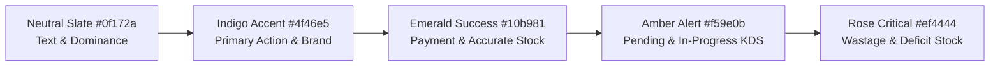
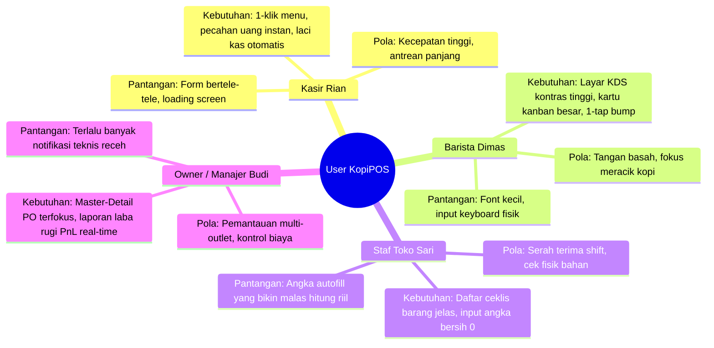
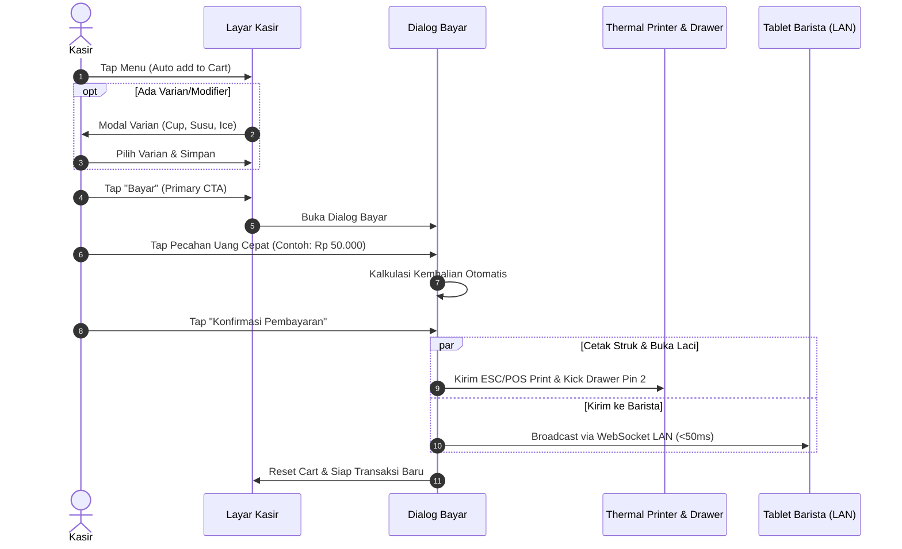

# 🎨 KopiPOS — Panduan Desain Sistem, UI/UX & Ergonomi Layar Sentuh

> **Dokumen Resmi Arsitektur Antarmuka, Pengalaman Pengguna (UX), dan Ergonomi Sentuh F&B**  
> *Versi: 2.0 │ Terakhir Diperbarui: 11 September 2026 │ Status: Production Standard*

---

## 📑 Daftar Isi
1. [Filosofi & Prinsip Utama Desain UI/UX](#1-filosofi--prinsip-utama-desain-uiux)
2. [Desain Sistem & Fondasi Visual](#2-desain-sistem--fondasi-visual)
   - 2.1 Palet Warna & Semantic Tokens
   - 2.2 Tipografi & Hirarki Keterbacaan
   - 2.3 Standar Sentuhan & Ergonomi Tablet (Fitts's Law)
   - 2.4 Elevasi, Sudut (*Border Radius*), dan Spacing
3. [Persona Pengguna & Pola Mental Kerja Kafe](#3-persona-pengguna--pola-mental-kerja-kafe)
4. [Alur Pengguna & Desain Pencegah Human Error (Anti-Fraud UX)](#4-alur-pengguna--desain-pencegah-human-error-anti-fraud-ux)
   - 4.1 Transaksi Cepat Kasir (<15 Detik)
   - 4.2 Rantai Pasok Bahan Baku (Request Staf ➔ Modifikasi PO Owner ➔ Verifikasi DO 3 Kolom)
   - 4.3 Hitung Fisik Opname Shift (Anti-Bias Tanpa Autofill)
   - 4.4 Alur Kitchen Display System (KDS) Real-Time via LAN
5. [Blueprint & Wireframe Antarmuka Per Layar](#5-blueprint--wireframe-antarmuka-per-layar)
   - 5.1 Layar Kasir Utama (`CashierPage.tsx`)
   - 5.2 Modal Manajemen Stok Staf (`StaffStockModal.tsx`)
   - 5.3 Dasbor Master-Detail PO & Laporan Owner (`ReportsPage.tsx`)
   - 5.4 Layar Dapur & Barista (`KitchenPage.tsx`)
   - 5.5 Layar Shift Kasir & Rekonsiliasi Kas (`ShiftPage.tsx`)
   - 5.6 Modal Diagnostik Hardware Thermal (`PrinterStatusModal.tsx`)
6. [Anatomi Komponen & Micro-Interactions](#6-anatomi-komponen--micro-interactions)
   - 6.1 Status Komponen (Default, Hover, Active, Empty, Error)
   - 6.2 Notifikasi Toast & Feedback Haptic/Visual
7. [Pedoman Responsivitas Multi-Device](#7-pedoman-responsivitas-multi-device)
8. [Aksesibilitas (A11y) & Ketahanan Lingkungan Bar](#8-aksesibilitas-a11y--ketahanan-lingkungan-bar)

---

## 1. Filosofi & Prinsip Utama Desain UI/UX

Aplikasi POS untuk kafe dan restoran beroperasi dalam lingkungan kerja yang unik: **sibuk, berisik, tangan staf sering basah/berminyak, antrean pelanggan panjang, dan pencahayaan bar bervariasi**.

Oleh karena itu, KopiPOS mengusung **4 Pilar Desain**:

```
+-----------------------------------------------------------------------------------+
|                            4 PILAR DESAIN KOPIPOS                                 |
+-------------------+-------------------+-------------------+-----------------------+
|  ⚡ KECEPATAN      |  🛡️ KEJUJURAN DATA|  ☕ ESTETIKA KAFE  |  🛑 ZERO HUMAN ERROR  |
|  (Velocity First) |  (Anti-Bias &     |  (Modern Clean    |  (Fail-Safe Design    |
|                   |   Anti-Fraud)     |   White-Label)    |   & Clear Affordance) |
| Transaksi selesai | Form hitung fisik | Tampilan elegan,  | Tombol destruktif     |
| dalam <15 detik;  | bersih tanpa      | tipografi rapi,   | terkonfirmasi, tombol |
| 1-tap add to cart;| autofill; cegah   | palet warna tenang| utama kontras, dialog |
| shortcut bayar pas| staf asal klik OK | ramah mata barista| terisolasi per konteks|
+-------------------+-------------------+-------------------+-----------------------+
```

---

## 2. Desain Sistem & Fondasi Visual

### 2.1 Palet Warna & Semantic Tokens

Desain visual KopiPOS menggunakan kombinasi warna netral Slate untuk mengurangi kelelahan mata (*eye fatigue*) dengan aksen warna fungsional yang memiliki arti tegas:



| Token | Nilai Hex | Tailwind Class | Penggunaan Utama |
|---|---|---|---|
| **Background App** | `#f1f5f9` | `bg-slate-100` | Latar belakang seluruh jendela POS |
| **Surface Card** | `#ffffff` | `bg-white` | Kartu menu, panel order, modal popup |
| **Text Primary** | `#0f172a` | `text-slate-900` | Nama produk, total belanja, judul header |
| **Text Muted** | `#64748b` | `text-slate-500` | Keterangan satuan, nomor seri, waktu jam |
| **Primary Brand** | `#4f46e5` | `bg-indigo-600` | Tombol CTA utama (Bayar, Setujui DO, Tab aktif) |
| **Success / Valid**| `#10b981` | `bg-emerald-600` | Lunas, stok cocok, pesanan selesai (Ready) |
| **Warning / Pending**| `#f59e0b`| `bg-amber-500` | Request menunggu tindakan, pesanan diracik |
| **Destructive** | `#ef4444` | `bg-rose-600` | Hapus cart, tolak request, kerugian (*wastage*) |

---

### 2.2 Tipografi & Hirarki Keterbacaan

Untuk memastikan data numerik tidak pernah tertukar antara harga, kuantitas gram, dan nominal kembalian, KopiPOS membagi penggunaan font menjadi dua keluarga:

1. **Font UI Utama (`Inter` / `Plus Jakarta Sans`)**:
   - Digunakan untuk label, navigasi, nama menu, dan dialog instruksional.
   - Bersifat humanis dengan proporsi tinggi *x-height* yang ramah dibaca pada sudut miring tablet kasir.
2. **Font Numerik Monospace (`JetBrains Mono` / `font-mono`)**:
   - Digunakan untuk **Nominal Rupiah (IDR)**, **Kuantitas Stok & Gramatur**, **Nomor DO/Invoice**, dan **Kode Register Kasir**.
   - Setiap digit memiliki lebar karakter persis sama sehingga angka pada tabel dan struk thermal selalu lurus sejajar secara vertikal.

```
HIRARKI TIPOGRAFI:
• Display / Grand Total : 28px - 32px (Font Black 900, Monospace)
• Judul Halaman / Modal : 18px - 20px (Font Black 900, Sans)
• Nama Menu / Kategori  : 14px - 15px (Font Bold 700, Sans)
• Body Text / Instruksi : 12px - 13px (Font Medium 500, Sans)
• Keterangan / Badge / ID: 10px - 11px (Font Bold 700, Uppercase)
```

---

### 2.3 Standar Sentuhan & Ergonomi Tablet (Fitts's Law)

Hukum Fitts menyatakan bahwa waktu untuk menyentuh target bergantung pada jarak dan ukuran target. Kasir bekerja dengan berdiri dan berpindah-pindah.

```
       MINIMUM TOUCH BOUNDARIES (TABLET 10-15 INCI)
       
       +---------------------------------------------+
       |                                             |
       |             [ 48px x 48px ]                 |  <-- Area sentuh minimum
       |               Target Sentuh                 |      (Tombol biasa/icon)
       |                                             |
       +---------------------------------------------+
       
       +---------------------------------------------+
       |                                             |
       |            [ 56px - 64px Tinggi ]           |  <-- Area sentuh tombol utama
       |          TOMBOL UTAMA: BAYAR KASIR          |      (Primary CTA - full width)
       |                                             |
       +---------------------------------------------+
```

* **Target Sentuh Minimum**: `48px x 48px` untuk setiap icon button dan selector varian.
* **Tombol Pembayaran Utama**: Ketinggian minimum `56px` dengan teks tebal kontras.
* **Jarak Aman (*Margin / Gap*)**: Minimum `8px` antar tombol untuk menghindari salah pencet (*fat finger error*).

---

### 2.4 Elevasi, Sudut (*Border Radius*), dan Spacing

* **Border Radius Modern**: Menggunakan `rounded-2xl` (16px) untuk tombol dan kartu, serta `rounded-3xl` (24px) untuk kontainer modal dan panel utama. Memberikan kesan ramah, modern, dan nyaman disentuh.
* **Subtle Elevation / Shadow**: Bayangan lembut `shadow-xs` hingga `shadow-md` yang dipadukan dengan border tipis `border border-slate-200` agar elemen tetap tegas terbaca pada layar tablet murah ber-kontras rendah.

---

## 3. Persona Pengguna & Pola Mental Kerja Kafe



---

## 4. Alur Pengguna & Desain Pencegah Human Error (Anti-Fraud UX)

### 4.1 Transaksi Cepat Kasir (<15 Detik)



---

### 4.2 Rantai Pasok Bahan Baku (Anti-Fraud Supply Chain)

Sistem memisahkan tanggung jawab secara tegas: **Staf di toko yang memegang barang fisik, Owner yang memiliki otorisasi uang dan persetujuan pembelian**.

```mermaid
flowchart TD
    subgraph STAF_POS [Sisi Staf Toko - POS Kasir]
        A1[Staf Buka Menu Request Stok] --> A2[Pilih Bahan & Kuantitas Dibutuhkan]
        A2 --> A3[Kirim Pengajuan Request]
    end

    subgraph OWNER_DASHBOARD [Sisi Owner / Manajer - Dashboard]
        B1[Notifikasi Request Baru Masuk] --> B2[Owner Buka Detail PO Terfokus]
        B2 --> B3{Owner Cek Kebutuhan}
        B3 -->|Modifikasi Jumlah| B4[Ubah Qty Sesuai Budget/Gudang Pusat]
        B3 -->|Setuju Langsung| B4
        B4 --> B5[Terbitkan Delivery Order - Nomor DO Resmi]
    end

    subgraph STAF_RECEIVE [Sisi Staf Toko - Kedatangan Fisik]
        C1[Barang Datang di Toko] --> C2[Staf Buka Menu Stok Masuk DO]
        C2 --> C3[Pilih / Cari Nomor Surat Jalan DO]
        C3 --> C4[Tabel 3 Kolom Muncul: Nama | Qty DO | Input Fisik]
        C4 --> C5[Staf Menghitung Fisik Riil - Kotak Input Bersih 0]
        C5 --> C6[Submit Penerimaan Fisik]
    end

    A3 -.->|Status: PENDING| B1
    B5 -.->|Status: ORDERED / DO Terbit| C1
    C6 -.->|Status: RECEIVED / Stok Bertambah| D[Stok Terkoreksi & Selesai]
```

> [!IMPORTANT]
> **Prinsip Desain Anti-Fraud Kolom 3**:
> Pada layar penerimaan barang dan stock opname, kotak kuantitas fisik **TIDAK PERNAH diisi otomatis (tanpa autofill)**. Jika angka sistem sudah terisi otomatis, staf cenderung hanya menekan tombol konfirmasi tanpa benar-benar menghitung kardus susu atau menimbang biji kopi di bar.

---

### 4.3 Hitung Fisik Opname Shift (Anti-Bias Tanpa Autofill)

1. Staf memilih sesi shift: `Shift 1 (Pagi)`, `Shift 2 (Malam)`, atau `Closing Harian`.
2. Sistem menyembunyikan riwayat audit masa lalu agar staf tidak terpengaruh catatan sebelumnya.
3. Input kuantitas fisik dimulai dari angka default `0`.
4. Saat disimpan:
   $$\text{Selisih Qty} = \text{Fisik Terhitung} - \text{Sisa Sistem POS}$$
   $$\text{Kerugian Selisih (Wastage Rp)} = |\text{Selisih Minus}| \times \text{HPP per Satuan}$$
5. Kerugian selisih otomatis menjadi faktor pengurang pada **Laporan Laba Rugi (P&L)** Owner tanpa staf toko perlu memikirkan perhitungan uang yang rumit.

---

## 5. Blueprint & Wireframe Antarmuka Per Layar

### 5.1 Layar Kasir Utama (`CashierPage.tsx`)

Layout layar kasir menggunakan sistem grid 2-kolom terpisah (*Split Layout*):
* **Kolom Kiri (65% Lebar)**: Area eksplorasi visual menu dan pencarian cepat.
* **Kolom Kanan (35% Lebar)**: Panel cart faktur pesanan yang selalu terlihat (*sticky*).

```
+-----------------------------------------------------------------------------------------------+
| [<-] KopiPOS | Toko: Kopi Nusa Senopati | Kasir: Rian H. | [⚡ Diagnostik] [📦 Stok] [⚙️ Setup]  |
+----------------------------------------------------------------+------------------------------+
| [ Cari menu kopi, pastry...                   (Cmd+K) ] [🔍]   | ORDER #INV-0042   [Dine-In v]|
+----------------------------------------------------------------+------------------------------+
| [⭐ Favorit] [☕ Kopi] [🍵 Non-Kopi] [🥐 Pastry] [🍟 Snack]    | Meja: [ Meja 04  v ]         |
+----------------------------------------------------------------+------------------------------+
| +--------------------+ +--------------------+ +---------------+ | 1x Kopi Susu Gula Aren       |
| | [ FOTO PRODUK ]    | | [ FOTO PRODUK ]    | | [ FOTO ]      | |    • Regular, Normal Ice     |
| | Kopi Susu Aren     | | Iced Latte         | | Croissant     | |    Rp 28.000       [ - 1 + ] |
| | Rp 28.000          | | Rp 32.000          | | Rp 25.000     | | 1x Iced Latte (Oat Milk)     |
| +--------------------+ +--------------------+ +---------------+ |    • Large, Less Sugar       |
| +--------------------+ +--------------------+ +---------------+ |    Rp 38.000       [ - 1 + ] |
| | [ FOTO PRODUK ]    | | [ FOTO PRODUK ]    | | [ FOTO ]      | |------------------------------|
| | Americano          | | Matcha Latte       | | Nasi Goreng   | | Subtotal           Rp 66.000 |
| | Rp 22.000          | | Rp 35.000          | | Rp 35.000     | | PB1 / Pajak Resto  Rp  6.600 |
| +--------------------+ +--------------------+ +---------------+ | GRAND TOTAL        Rp 72.600 |
|                                                                |------------------------------|
|                                                                | [🗑️ Hapus Cart]               |
|                                                                | [💳 PROSES BAYAR  (Rp 72.600)]|
+----------------------------------------------------------------+------------------------------+
```

---

### 5.2 Modal Manajemen Stok Staf (`StaffStockModal.tsx`)

Modal dirancang dengan **Tab Navigasi Atas** yang tegas membagi tanggung jawab staf menjadi 3 alur mandiri:

```
+-----------------------------------------------------------------------------------------------+
| 📦 MANAJEMEN STOK OPERASIONAL TOKO                                                        [X] |
+-----------------------------------------------------------------------------------------------+
|   [ 📝 1. Request Stok Bahan ]  |  [ 📥 2. Stok Masuk (DO) ]  |  [ 📋 3. Stock Opname Shift ] |
+-----------------------------------------------------------------------------------------------+
|                                                                                               |
|   SURAT JALAN & VERIFIKASI FISIK KEDATANGAN BARANG (MENU 2)                                   |
|   Pilih nomor Surat Jalan (DO) yang dikirim oleh Owner / Roastery:                            |
|                                                                                               |
|   [ Cari No. Surat Jalan DO...                       ] [🔍]                                   |
|   +---------------------------------------------------------------------------------------+   |
|   | (•) DO-2026/09/02-12  •  Pengirim: Roastery Pusat  •  2 Item Bahan  •  Tiba Hari Ini  |   |
|   | ( ) DO-2026/09/01-08  •  Pengirim: Supplier Susu   •  1 Item Bahan  •  Kemarin        |   |
|   +---------------------------------------------------------------------------------------+   |
|                                                                                               |
|   VERIFIKASI FISIK BARANG (ANTI-FRAUD VERIFICATION):                                          |
|   +------------------------------------+--------------------------+-----------------------+   |
|   | Nama Bahan Baku                    | Qty Tertera di Surat DO  | Input Qty Fisik Datang|   |
|   +------------------------------------+--------------------------+-----------------------+   |
|   | Biji Kopi House Blend (Espresso)   | 10 kg                    | [   10.0   ] kg       |   |
|   | Fresh Milk Pasteurisasi            | 20 Liter                 | [    0.0   ] Liter *  |   |
|   +------------------------------------+--------------------------+-----------------------+   |
|                                                                     *Kotak tanpa autofill     |
|                                                                                               |
|                                                     [ Batal ]  [ ✅ Konfirmasi Terima Barang ] |
+-----------------------------------------------------------------------------------------------+
```

---

### 5.3 Dasbor Master-Detail PO & Laporan Owner (`ReportsPage.tsx`)

Pada menu Owner, pemeriksaan PO menggunakan pola **Master-Detail View** agar perhatian pemilik terfokus pada satu pengiriman dan tidak salah menyetujui kuantitas:

```
+-----------------------------------------------------------------------------------------------+
| 👑 LAPORAN & ANALITIK OWNER | Outlet: Kopi Nusa Senopati       [📅 Harian] [📆 7 Hari] [🗓️ 30 Hari] |
+-----------------------------------------------------------------------------------------------+
| [📈 Penjualan]  [📝 1. Request Stok (2)]  [📥 2. Stok Masuk]  [📋 3. Laporan Audit]  [💰 P&L]   |
+-----------------------------------------------------------------------------------------------+
|                                                                                               |
|   DETAIL PURCHASE ORDER #REQ-202                                           [ <- Kembali ]     |
|   Status: ⏳ Menunggu Tindakan Owner  •  Diajukan oleh: Budi K. (Kasir)  •  Urgensi: 🔴 MENDESAK |
|                                                                                               |
|   Nomor Delivery Order (DO): [ DO-2026/09/02-15                                           ]   |
|                                                                                               |
|   MODIFIKASI KUANTITAS BAHAN YANG AKAN DIKIRIM KE TOKO:                                       |
|   +-----------------------------------------+------------------+-------------------+------+   |
|   | Nama Bahan Baku                         | Diminta Staf     | Kuantitas Kirim   | Aksi |   |
|   +-----------------------------------------+------------------+-------------------+------+   |
|   | Biji Kopi House Blend (kg)              | 10 kg            | [  8.0  ] kg      | [🗑️] |   |
|   | Sirup Gula Aren Cair (Liter)            | 5 Liter          | [  5.0  ] Liter   | [🗑️] |   |
|   +-----------------------------------------+------------------+-------------------+------+   |
|   [ + Tambah Bahan Tambahan ]                                                                 |
|                                                                                               |
|   [ ❌ Tolak Request ]                  [ ⚡ Setujui Asli ]   [ 🚀 Setujui & Terbitkan DO ]   |
+-----------------------------------------------------------------------------------------------+
```

---

### 5.4 Layar Dapur & Barista (`KitchenPage.tsx`)

Layar KDS dirancang untuk tablet 10-12 inci yang dipasang di atas meja bar kopi (*Bar mount*):

```
+-----------------------------------------------------------------------------------------------+
| 🍵 KDS BARISTA LAN (<50ms) | Status: 🟢 Terhubung | Total Tiket Aktif: 4      [ 🖨️ Cetak Ulang ] |
+--------------------------------+-------------------------------+------------------------------+
| 🔴 PENDING (1 Tiket)           | 🟡 IN PROGRESS (2 Tiket)      | 🟢 READY FOR PICKUP (1 Tiket)|
+--------------------------------+-------------------------------+------------------------------+
| +----------------------------+ | +---------------------------+ | +--------------------------+ |
| | TIKET #0042      ⏱️ 02:15 m | | | TIKET #0040     ⏱️ 06:40 m | | | TIKET #0039    ⏱️ 11:20 m | |
| | Meja: 04 • [Dine-In]       | | | Meja: 02 • [Takeaway]     | | | Meja: 08 • [Dine-In]     | |
| |----------------------------| | |---------------------------| | |--------------------------| |
| | 1x Kopi Susu Aren          | | | 2x Iced Latte (Oat Milk)  | | | 1x Americano Hot         | |
| |    - Less Sugar, Less Ice  | | |    - Less Ice             | | |    - Double Shot         | |
| | 1x Croissant Butter        | | | 1x Matcha Latte Hot       | | |                          | |
| |----------------------------| | |---------------------------| | |--------------------------| |
| | [ 🟡 MULAI RACIK ]         | | | [ 🟢 SELESAI RACIK ]      | | | [ ✅ BUMP / AMBIL ]      | |
| +----------------------------+ | +---------------------------+ | +--------------------------+ |
+--------------------------------+-------------------------------+------------------------------+
```

---

### 5.5 Layar Shift Kasir & Rekonsiliasi Kas (`ShiftPage.tsx`)

```
+-----------------------------------------------------------------------------------------------+
| 🕐 MANAJEMEN SHIFT & KAS KASIR                                                [ 🖨️ Cetak Z-Report ] |
+-----------------------------------------------------------------------------------------------+
| Status Shift: 🟢 AKTIF (Shift 2 Sore)  •  Kasir: Rian H.  •  Mulai: 14:30 WIB                 |
+-----------------------------------------------------------------------------------------------+
| +-------------------------------+ +-------------------------------+ +------------------------+ |
| | KAS AWAL MODAL REGISTER       | | TOTAL PENJUALAN CASH          | | KAS SEHARUSNYA DI LACI | |
| | Rp 500.000                    | | Rp 2.100.000 (78 Trx)         | | Rp 2.600.000           | |
| +-------------------------------+ +-------------------------------+ +------------------------+ |
|                                                                                               |
| TUTUP SHIFT & HITUNG FISIK UANG DI LACI KAS:                                                  |
| Input Uang Fisik Aktual di Laci Kas: [ Rp 2.580.000                             ]             |
|                                                                                               |
| STATUS REKONSILIASI KAS:                                                                      |
| [ ⚠️ SELISIH MINUS: -Rp 20.000 ]  (Uang fisik di laci kurang Rp 20.000 dari catatan sistem)    |
|                                                                                               |
|                                                        [ 🔒 Simpan Rekonsiliasi & Tutup Shift ] |
+-----------------------------------------------------------------------------------------------+
```

---

## 6. Anatomi Komponen & Micro-Interactions

### 6.1 Status Komponen (*Component States*)

Setiap elemen interaktif wajib memiliki **6 State Visual** yang konsisten:

```
[ DEFAULT ]     : bg-indigo-600 text-white shadow-xs
[ HOVER ]       : bg-indigo-700 shadow-md translate-y-[-1px]
[ ACTIVE/TAP ]  : bg-indigo-800 scale-[0.98] transition-transform (Haptic visual feel)
[ DISABLED ]    : bg-slate-200 text-slate-400 cursor-not-allowed opacity-60
[ FOCUS/INPUT ] : border-2 border-indigo-600 ring-4 ring-indigo-500/20 outline-none
[ ERROR SHAKE ] : border-rose-500 bg-rose-50 animate-shake
```

---

### 6.2 Notifikasi Toast & Feedback Haptic/Visual

Notifikasi muncul di pojok kanan bawah (`bottom-6 right-6 z-50`) dengan animasi fade-in dan ikon yang jelas:

* ✅ **Success Toast** (`bg-slate-900 border-emerald-500/40 text-emerald-400`):
  *"Stok masuk berhasil dicatat & stok bahan langsung bertambah!"*
* ⚠️ **Warning Toast** (`bg-slate-900 border-amber-500/40 text-amber-400`):
  *"Jumlah pengiriman bahan harus lebih dari 0."*
* ❌ **Error Toast** (`bg-slate-900 border-rose-500/40 text-rose-400`):
  *"Permintaan stok ditolak oleh Owner."*

---

## 7. Pedoman Responsivitas Multi-Device

| Tipe Perangkat | Resolusi Sasaran | Orientasi | Penyesuaian UI |
|---|---|---|---|
| **POS Terminal All-in-One** | 1920 x 1080 (15.6") | Landscape | Layout 2 kolom penuh, Menu grid 4 kolom kartu, panel cart lebar |
| **Tablet Kasir / Barista** | 1280 x 800 (10.1") | Landscape | Menu grid 3 kolom kartu, font compact, touch target minimum 48px |
| **Tablet Dapur KDS** | 1024 x 768 (9.7") | Landscape | 3 kolom kanban fleksibel horizontal scroll, kartu order full-height |
| **Owner Mobile Monitor** | 390 x 844 (Mobile) | Portrait | Single column stack, tabel responsif horizontal-scroll |

---

## 8. Aksesibilitas (A11y) & Ketahanan Lingkungan Bar

1. **Rasio Kontras Warna (WCAG AA Standard)**:
   - Seluruh teks penting memiliki rasio kontras minimal **4.5:1** terhadap latar belakangnya.
   - Angka nominal harga menggunakan hitam pekat `#0f172a` di atas putih bersih `#ffffff` (Rasio 19.5:1).
2. **Indikator Bukan Hanya Warna (Multi-Cue Affordance)**:
   - Status KDS dan status stok tidak hanya menggunakan warna, tetapi selalu menyertakan teks dan ikon:
     - 🔴 Defisit / Wastage disertai ikon `AlertTriangle`.
     - 🟢 Cocok / Lunas disertai ikon `CheckCircle2`.
     - ⏳ Pending / Menunggu disertai ikon `Clock`.
3. **Pemberitahuan Suara (Audio Chime)**:
   - KDS membunyikan nada lonceng (*pleasant chime*) saat tiket baru masuk dari kasir agar barista yang sedang membelakangi tablet tetap waspada.
